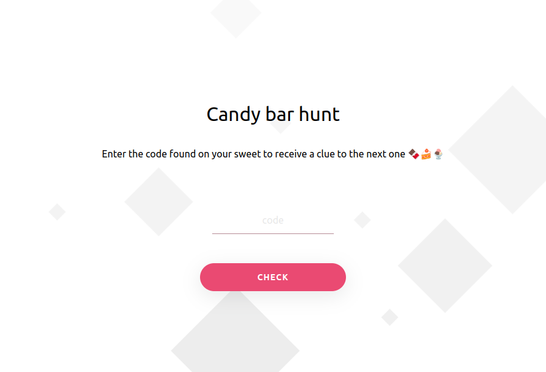
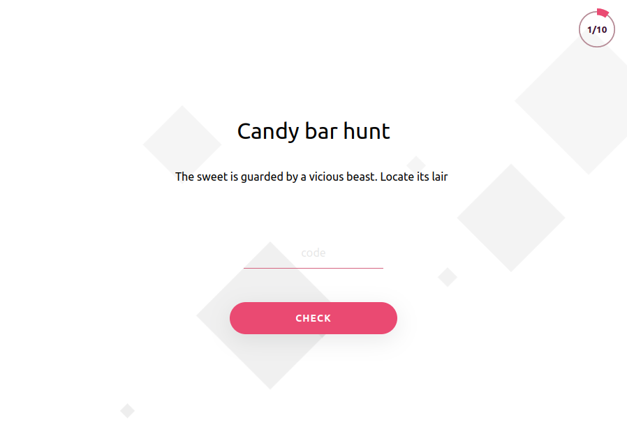

# Scavenger Hunt

Send your friends and family on small scavenger hunts to locate sweets or other goodies.

### How it works

Hide items with some secret codes written/printed on them, define hints to their locations in
[quest.yml](src/main/resources/quest.yml) file and deploy the app somewhere reachable by the
participants.

Let participants stumble upon the first item or give them a link containing the first code to start the hunt.

Codes can be entered manually in the UI or using links, e.g. `https://find.me/{code}`.

### Screenshots

### Requirements

* Java 17 or later

### Setup

* Clone this repository
* Define hints to items, codes, etc. in [quest.yml](src/main/resources/quest.yml)
* Run the app `./gradlew bootRun`
* Check out the page at http://localhost:8080

### Useful:

* [Build & Run](doc/build-and-run.md)
* [API examples](doc/api-call-examples.md)

### Library docs:

* [Materialize](https://materializecss.com)
* [ProgressBar.js](https://kimmobrunfeldt.github.io/progressbar.js)
* [TypewriterJS](https://safi.me.uk/typewriterjs)
